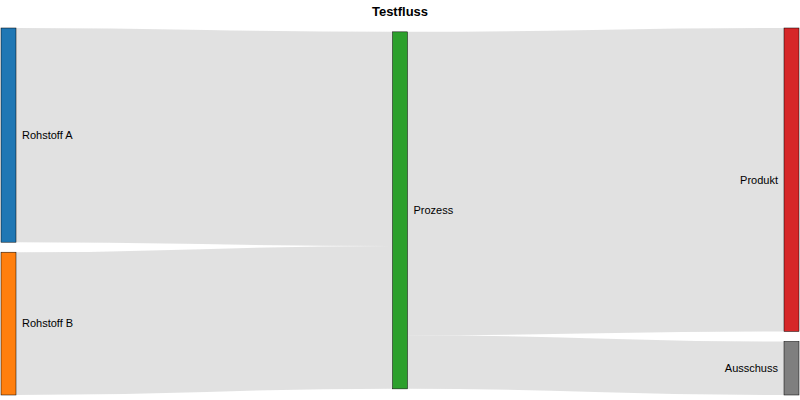

# CWC-Sankey

**Sankey-Diagramm für WinCC Unified** — Custom Web Control zur Darstellung von Fluss-/Mengendiagrammen (Sankey) auf Basis von D3.js, vollständig über JSON-Properties konfigurierbar.

---

## Vorschau



*Beispieldaten, gerendert per Headless-Chromium mit WebCC-Stub (siehe [CONTRIBUTING.md](CONTRIBUTING.md)).*

---

## Features

- **Nodes & Links per Property** — Datenstruktur und Farben frei aus TIA Portal oder WinCC-Skript setzbar
- **D3.js + d3-sankey** — robustes, automatisches Layout (Knotenpositionen, Flussbreiten)
- **NodeClicked-Event** — WinCC wird benachrichtigt, wenn ein Knoten angeklickt wird
- **Responsive** — Diagramm passt sich bei Größenänderung des Controls automatisch an
- **Kein Internet** erforderlich — alle Bibliotheken lokal gebundelt
- Einsetzbar in **Faceplates**, Popups und normalen Bildern

---

## Voraussetzungen

- WinCC Unified (TIA Portal)
- Panel oder PC Runtime mit Chromium-basiertem Browser

---

## Disclaimer / Haftungsausschluss

**English**

This software is provided "as is", without warranty of any kind, express or implied.
The author makes no representations or warranties regarding the accuracy, completeness,
or suitability of this software for any particular purpose.

This control is designed exclusively for the **display** of process data in WinCC Unified.
It does not write to, modify, or interfere with any PLC program, machine configuration,
or control system.

The author assumes no liability for any direct, indirect, incidental, or consequential
damages arising from the use or inability to use this software, including but not limited to:

- Incorrect or delayed display of process values
- Data loss or data corruption
- Unplanned machine downtime or production loss
- Damage to equipment or infrastructure
- Personal injury or property damage

Use in safety-relevant systems (functional safety, SIL, Performance Level) is explicitly
not recommended without independent verification by a qualified engineer.

By using this software, you agree that you use it entirely at your own risk.

**Deutsch**

Diese Software wird ohne jegliche ausdrückliche oder implizite Gewährleistung bereitgestellt.
Der Autor übernimmt keine Garantie für die Korrektheit, Vollständigkeit oder Eignung der
Software für einen bestimmten Zweck.

Dieses Control dient ausschließlich der **Anzeige** von Prozessdaten in WinCC Unified.
Es nimmt keine Änderungen an SPS-Programmen, Maschinenkonfigurationen oder Steuerungssystemen vor.

Der Autor übernimmt keine Haftung für direkte, indirekte oder Folgeschäden, die aus der Nutzung
oder Nichtnutzbarkeit dieser Software entstehen, einschließlich, aber nicht beschränkt auf:

- Fehlerhafte oder verzögerte Anzeige von Prozesswerten
- Datenverlust oder Datenbeschädigung
- Ungeplante Maschinenstillstände oder Produktionsausfälle
- Schäden an Anlagen oder Infrastruktur
- Personen- oder Sachschäden

Die Verwendung in sicherheitsrelevanten Systemen (funktionale Sicherheit, SIL, Performance Level)
wird ohne unabhängige Prüfung durch einen qualifizierten Ingenieur ausdrücklich nicht empfohlen.

Mit der Nutzung dieser Software erklärst du dich damit einverstanden, dass du sie auf eigenes Risiko verwendest.

---

## Installation in TIA Portal

1. Projektordner als ZIP packen — Dateiname = GUID aus `manifest.json`, Uppercase in `{}`:
   ```
   {ED1175BD-33EA-44D7-B9C8-F6DDC84614C3}.zip
   ```
2. ZIP kopieren nach:
   ```
   C:\Program Files\Siemens\Automation\Portal V21\Data\Hmi\CustomControls\
   ```
   (oder projektspezifisch nach `[Projekt]\UserFiles\CustomControls\`)
3. TIA Portal **komplett** neu starten (nicht nur Projekt neu laden)
4. Toolbox → **Werkzeuge → Eigene Controls → Aktualisieren**
5. Control per Drag & Drop auf ein Bild ziehen

### Update

Neue ZIP ersetzen → TIA Portal neu starten → Projekt kompilieren → laden.

---

## Properties

Alle Properties sind im TIA Portal Inspektorfenster unter **Eigenschaften → Verschiedenes → Schnittstelle** konfigurierbar, komplexe Properties (`Nodes`, `Links`) am praktikabelsten per WinCC-Skript setzen.

| Property | Typ | Beschreibung |
|---|---|---|
| `Title` | string | Optionale Überschrift über dem Diagramm |
| `Nodes` | Array&lt;Node&gt; | Liste der Knoten: `{ Name: string, RGB: "r, g, b" }` |
| `Links` | Array&lt;Link&gt; | Liste der Flüsse: `{ Source: string, Target: string, Value: number, RGB: "r, g, b" }` — `Source`/`Target` referenzieren `Node.Name` |

Links, deren `Source`/`Target` keinem bekannten Knotennamen entspricht, werden beim Rendern ignoriert.

---

## Events

| Event | Argumente | Beschreibung |
|---|---|---|
| `NodeClicked` | `name: string` | Benutzer hat einen Knoten angeklickt |

---

## WinCC-Integration: Beispiel

```javascript
// Im Bildskript, z. B. bei Bild.OnLoaded oder einem Trigger:
export function Sankey_1_LoadData(item) {
    var nodes = [
        { Name: "Rohstoff A", RGB: "31, 119, 180" },
        { Name: "Rohstoff B", RGB: "255, 127, 14" },
        { Name: "Prozess",    RGB: "44, 160, 44" },
        { Name: "Produkt",    RGB: "214, 39, 40" },
        { Name: "Ausschuss",  RGB: "127, 127, 127" }
    ];

    var links = [
        { Source: "Rohstoff A", Target: "Prozess",  Value: 60, RGB: "180, 180, 180" },
        { Source: "Rohstoff B", Target: "Prozess",  Value: 40, RGB: "180, 180, 180" },
        { Source: "Prozess",    Target: "Produkt",  Value: 85, RGB: "180, 180, 180" },
        { Source: "Prozess",    Target: "Ausschuss", Value: 15, RGB: "180, 180, 180" }
    ];

    Screen.Items("Sankey_1").Nodes = nodes;
    Screen.Items("Sankey_1").Links = links;
}

// Reaktion auf Knotenklick:
export function Sankey_1_NodeClicked(item, name) {
    HMIRuntime.Trace("Sankey-Knoten angeklickt: " + name);
}
```

---

## Projektstruktur

```
CWC-Sankey/
├── manifest.json           CWC-Manifest (Properties/Events-Vertrag)
├── assets/                 Icon
└── control/
    ├── index.html          Entry Point
    ├── code.js             WebCC-Bootstrap
    ├── sankey.js            Rendering-Logik (D3 + d3-sankey)
    ├── styles.css
    └── js/                 Lokal gebundelte Bibliotheken (webcc, d3, d3-sankey)
```

---

## Mitwirken

Siehe [CONTRIBUTING.md](CONTRIBUTING.md) — Beiträge unterliegen zusätzlich zur
[GNU General Public License v3.0](LICENSE) dem [Contributor License Agreement](.github/CLA.md).

---

## Drittlizenzen

| Bibliothek | Lizenz | Quelle |
|---|---|---|
| D3.js | ISC | https://d3js.org |
| d3-sankey | ISC | https://github.com/d3/d3-sankey |
| WebCC (webcc.min.js) | Siemens, Bestandteil von WinCC Unified | https://support.industry.siemens.com/cs/ww/de/view/109779176 |

---

## Lizenz

[GNU General Public License v3.0](LICENSE)
